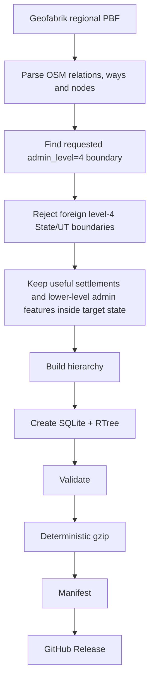
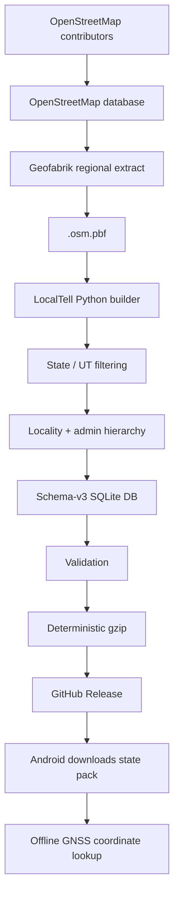

# LocalTell — OpenStreetMap, Geofabrik, Administrative Boundaries & Geographic Pack Guide

This document explains the geographic-data concepts used by **LocalTell**, including OpenStreetMap (OSM), Geofabrik extracts, OSM elements and tags, administrative levels, place types, India-specific boundary hierarchy, `.osm.pbf` files, state-pack generation, validation, and the relationship between regional source files and LocalTell's downloadable state/UT packs.

> This is a technical reference for maintaining the `localtell-data` repository. It is not a general-purpose navigation-map implementation guide.

---

## 1. Why LocalTell uses OpenStreetMap data

LocalTell needs to answer a relatively simple offline question:

> **Given a latitude and longitude, what locality is this coordinate in or near?**

The app does **not** need to render a full road map. It mainly needs:

- State / Union Territory boundaries
- District boundaries
- Subdistrict / Taluk / Tehsil boundaries
- Named settlements such as neighbourhoods, suburbs, localities, hamlets, villages, towns, and cities

OpenStreetMap is a good fit because it contains geographic coordinates, named places, administrative boundaries, settlement classifications, polygon geometry, worldwide coverage, and downloadable raw data suitable for offline processing.

LocalTell converts a much larger OpenStreetMap extract into small state-specific SQLite databases optimized for offline lookup on Android.

---

## 2. What is OpenStreetMap?

**OpenStreetMap (OSM)** is a collaborative geographic database of real-world features.

It is often described as a map, but technically it is better understood as a **structured geographic database** from which maps and geographic applications can be built.

OSM can describe features such as countries, states, districts, cities, towns, villages, neighbourhoods, roads, railways, rivers, buildings, shops, hospitals, schools, parks, bus routes, and administrative boundaries.

LocalTell consumes only the subset required for offline locality resolution.

---

## 3. The OSM data model

OpenStreetMap has three core geographic element types:

```text
Node
Way
Relation
```

All three may have **tags** that describe what the object means.

### 3.1 Node

A **node** is a single latitude/longitude point.

Example conceptually:

```text
Node
latitude = 12.9716
longitude = 77.5946
place = city
name = Bengaluru
```

A node may represent a settlement centre, bus stop, shop, traffic signal, well, tree, point of interest, or one vertex used to construct a way.

For LocalTell, settlement nodes are especially useful because many villages, towns, suburbs, and neighbourhoods are mapped as points rather than complete polygons.

### 3.2 Way

A **way** is an ordered list of nodes.

A way may represent a line such as a road, river, or railway, or a closed area such as a building, park, land parcel, or small boundary.

A closed way has the same starting and ending point.

### 3.3 Relation

A **relation** groups nodes, ways, and/or other relations together.

Relations are important for complex geographic structures such as:

- administrative boundaries;
- multipolygons;
- routes;
- turn restrictions;
- public transport routes.

A large state boundary may consist of many separate ways. A relation groups those ways into one logical boundary.

Conceptually:

```text
Karnataka boundary relation
├── outer way 1
├── outer way 2
├── outer way 3
└── ...
```

Relations can also contain `inner` members, for example holes inside a multipolygon.

---

## 4. What are OSM tags?

A **tag** is a key/value pair describing an OSM object.

General form:

```text
key=value
```

Examples:

```text
name=Karnataka
boundary=administrative
admin_level=4
ISO3166-2=IN-KA
```

or:

```text
name=Attibele
place=town
```

Tags are flexible. Different features use different keys.

---

## 5. Common OSM feature families

OSM contains a very large tagging ecosystem. Some common feature families include:

| Key / family | Typical purpose |
|---|---|
| `highway=*` | Roads, paths, streets and related road infrastructure |
| `railway=*` | Rail infrastructure |
| `waterway=*` | Rivers, streams, canals |
| `natural=*` | Natural features |
| `landuse=*` | Land-use classification |
| `building=*` | Buildings |
| `amenity=*` | Hospitals, schools, restaurants, public facilities, etc. |
| `shop=*` | Retail features |
| `tourism=*` | Hotels, attractions, museums, etc. |
| `public_transport=*` | Public transport infrastructure |
| `boundary=*` | Administrative and other boundaries |
| `place=*` | Named settlements and geographic places |

LocalTell currently focuses mainly on:

```text
boundary=administrative
admin_level=*
place=*
name=*
ISO3166-2=*
```

---

## 6. `place=*` — named settlements and places

The `place=*` key identifies named geographic places.

LocalTell schema-v3 currently supports these settlement types:

```text
neighbourhood
suburb
locality
hamlet
village
town
city
```

LocalTell intentionally does **not** treat every possible OSM `place=*` value as a user-facing locality.

For example, a state boundary may sometimes also carry:

```text
place=state
boundary=administrative
admin_level=4
```

For LocalTell, such an object is an **administrative boundary**, not a settlement result. Therefore the builder normalizes unsupported `place=*` values on valid administrative features to:

```text
administrative_boundary
```

rather than exposing a value such as `state` as a settlement type.

---

## 7. `boundary=administrative`

The OSM tag:

```text
boundary=administrative
```

indicates an officially recognized administrative area.

Examples can include a country, state, union territory, district, subdistrict, municipality, or other administrative division.

The exact meaning is refined using:

```text
admin_level=*
```

---

## 8. What is `admin_level`?

`admin_level=*` describes where an administrative boundary sits in a hierarchy.

A smaller number usually represents a larger/higher-level administrative area. However, **admin-level meanings are country-specific**. An `admin_level=6` object in one country does not necessarily represent exactly the same legal type as `admin_level=6` in another country.

For India, the OpenStreetMap India guidance currently documents the hierarchy approximately as follows:

| `admin_level` | India meaning |
|---:|---|
| `2` | National boundary of India |
| `3` | Zonal Council / North Eastern Council — documented as proposed usage |
| `4` | State / Union Territory |
| `5` | District |
| `6` | Subdistrict: Tehsil / Taluka / Taluk / Mandal / Circle / Subdivision / Commune Panchayat |
| `7` | Block / Revenue Circle |
| `8` | No single nationwide LocalTell hierarchy meaning currently relied upon |
| `9` | Revenue Village |
| `10` | Revenue Survey Number |

LocalTell currently uses the hierarchy:

```text
admin_level 4 → State / Union Territory
admin_level 5 → District
admin_level 6 → Taluk / Taluka / Tehsil / Mandal / Subdistrict
```

The geographic builder currently recognizes administrative features in levels `4, 5, 6, 7, 8`, but the LocalTell locality hierarchy presently derives its primary labels from levels `4, 5, 6`.

---

## 9. Administrative area vs settlement place

A place and an administrative area are not always the same thing.

For example, a `place=city` feature describes a settlement classification, while `boundary=administrative` + `admin_level=*` describes an administrative jurisdiction. Their geographic extents can differ even when they share the same name.

LocalTell keeps these concepts separate.

---

## 10. Why LocalTell needs both places and administrative boundaries

Suppose the user is physically located near a neighbourhood in Bengaluru.

A settlement feature may tell LocalTell:

```text
D'Souza Layout
```

while administrative boundaries may provide:

```text
Subdistrict: Bangalore North
District: Bengaluru Urban
State: Karnataka
```

Together LocalTell can produce a result such as:

```text
D'Souza Layout
Bangalore North, Bengaluru Urban, Karnataka
```

---

## 11. LocalTell settlement priority

LocalTell's current locality priority is:

```text
1. neighbourhood
2. suburb
3. locality
4. hamlet
5. village
6. town
7. city
```

This means a coordinate in a major city may return a more specific neighbourhood or suburb rather than simply returning the large city name.

---

# Part II — Geofabrik

## 12. What is Geofabrik?

**Geofabrik** is a company specializing in OpenStreetMap services and operates a widely used download server that provides regularly generated geographic extracts of OSM data.

Instead of downloading a planet-wide dataset, developers can download smaller extracts such as India or one of India's Geofabrik sub-regions.

Conceptually:

```text
OpenStreetMap contributors
        ↓
OpenStreetMap database
        ↓
Geofabrik processing
        ↓
regional downloadable extracts
        ↓
LocalTell builder
```

Geofabrik is **not OpenStreetMap itself**; it is an extract/data provider built around OSM data.

---

## 13. Geofabrik India extract

Geofabrik provides a full India extract:

```text
india-latest.osm.pbf
```

The full India PBF is significantly larger than individual zone extracts, so LocalTell can reduce download/build resource usage by working with Geofabrik's India sub-regions.

---

## 14. Geofabrik India sub-regions

Geofabrik currently publishes six India sub-regions:

```text
Central Zone
Eastern Zone
North-Eastern Zone
Northern Zone
Southern Zone
Western Zone
```

Typical PBF names are:

```text
central-zone-latest.osm.pbf
eastern-zone-latest.osm.pbf
north-eastern-zone-latest.osm.pbf
northern-zone-latest.osm.pbf
southern-zone-latest.osm.pbf
western-zone-latest.osm.pbf
```

### Important distinction

These Geofabrik zones are primarily **download/extract boundaries**.

LocalTell should not assume that:

```text
Geofabrik region = one LocalTell runtime pack
```

Instead:

```text
Geofabrik Southern Zone PBF
        ↓
build input
        ↓
TN.db
KL.db
KA.db
AP.db
TS.db
PY.db
...
```

The large regional PBF is a **source**, while the downloadable LocalTell runtime unit remains a **State/UT pack**.

---

## 15. Geofabrik region vs Indian administrative region

Do not confuse a Geofabrik zone with an OSM administrative boundary.

### Geofabrik zone

Used for:

```text
download organization
build input
data extraction
```

### OSM administrative boundary

Used for:

```text
geographic hierarchy
state identification
district identification
subdistrict identification
```

A Geofabrik zone should never be shown to a LocalTell user as their administrative location.

---

## 16. Geofabrik file types

A Geofabrik region page can provide several formats and supporting files.

### `.osm.pbf`

Example:

```text
southern-zone-latest.osm.pbf
```

This is the format LocalTell currently uses. Benefits include compact binary storage, efficient sequential processing, and good support in Osmium/pyosmium and related OSM tooling.

### `.shp.zip`

ESRI Shapefile export, useful for traditional GIS workflows. LocalTell does not currently require it.

### `.gpkg.zip`

GeoPackage export, useful for GIS applications. LocalTell does not use the Geofabrik GeoPackage directly because it creates its own optimized runtime SQLite schema.

### `.poly`

A polygon describing the extraction extent of a Geofabrik region.

### `.osc.gz`

OSM change files containing incremental changes. LocalTell currently prefers periodic fresh builds instead of maintaining a continuous incremental-diff pipeline.

### Checksum files

Geofabrik provides checksum files for downloadable datasets. LocalTell verifies source integrity before building.

The source checksum serves a different purpose from LocalTell release SHA-256:

```text
Geofabrik checksum
    ↓
Did the source PBF download correctly?

LocalTell SHA-256
    ↓
Is this exactly the DB/gzip asset we built, validated, and published?
```

---

## 17. Why LocalTell uses regional PBFs instead of one PBF per state

A separate official Geofabrik PBF is not required for every state.

LocalTell can take a larger source such as:

```text
southern-zone-latest.osm.pbf
```

and extract individual state data by finding the OSM level-4 boundary:

```text
boundary=administrative
admin_level=4
ISO3166-2=IN-TN
```

Then:

```text
Southern Zone PBF
       ↓
find IN-TN boundary
       ↓
filter features inside Tamil Nadu
       ↓
TN.db
```

The same source PBF can be reused for several state builds.

---

# Part III — India State Extraction

## 18. ISO 3166-2 state code

State boundaries often include codes such as:

```text
ISO3166-2=IN-TN
ISO3166-2=IN-KL
ISO3166-2=IN-KA
```

LocalTell uses these codes to identify the target level-4 boundary.

Examples:

| Pack | State/UT | State code |
|---|---|---|
| `TN` | Tamil Nadu | `IN-TN` |
| `KL` | Kerala | `IN-KL` |
| `KA` | Karnataka | `IN-KA` |

The LocalTell config maps pack ID, name, state code, source region, pack version, and enabled state.

Example:

```json
{
  "id": "KA",
  "name": "Karnataka",
  "stateCode": "IN-KA",
  "region": "south",
  "source": "southern-zone",
  "packVersion": 3,
  "enabled": true
}
```

---

## 19. State extraction logic



---

## 20. Why foreign level-4 boundaries must be rejected

A real OSM edge case can allow a foreign state feature's representative point to fall inside the target-state polygon because of geometry complexity or representative-point selection.

Therefore LocalTell's rule is:

```text
Requested level-4 boundary → keep
Any other level-4 State/UT boundary → reject
Lower-level admin boundary inside target → may keep
Settlement inside target → may keep
```

This prevents one state pack from accidentally storing another state as part of its hierarchy.

---

## 21. Administrative `place=state` normalization

An OSM feature can carry both:

```text
boundary=administrative
admin_level=4
place=state
```

LocalTell's supported settlement set does not include `state`, so the builder interprets this object as:

```text
administrative_boundary
```

rather than a user-facing place.

---

# Part IV — Geometry

## 22. Polygon boundaries

A state or district is normally represented by polygon geometry.

Conceptually:

```text
(lat1, lon1)
(lat2, lon2)
(lat3, lon3)
...
(lat1, lon1)
```

The first and last coordinate close the ring.

LocalTell stores simplified ring geometry suitable for its Android point-in-polygon resolver.

---

## 23. Representative points

Not every OSM feature has a simple standalone point. For polygon features, the builder derives a representative interior point when needed.

This point helps with determining whether a feature lies inside a target state, assigning hierarchy, and nearest-place calculations.

A representative point must be treated carefully for large or concave polygons, which is why state-level filtering has additional safeguards.

---

## 24. Multipolygons and relation members

Complex areas may be represented using multiple ways inside an OSM relation.

Common member roles include:

```text
outer
inner
```

`outer` defines the exterior; `inner` can define holes.

LocalTell's current Android geographic contract is intentionally simpler than a full GIS engine. The builder prepares geometry for the runtime lookup model rather than reproducing every OSM geometry capability.

---

## 25. Geometry simplification

Raw OSM polygons can contain many points.

LocalTell simplifies geographic rings before storing them.

Current default tolerance:

```text
0.00015 degrees
```

This is on the order of tens of metres, depending on latitude.

The purpose is to reduce database size, Android parsing work, and spatial lookup cost. The builder retains the original ring if simplification would produce invalid geometry.

---

## 26. RTree spatial index

LocalTell state databases include an SQLite RTree index.

Conceptually:

```text
polygon
    ↓
bounding box
    ↓
RTree
```

Before running an expensive point-in-polygon check, LocalTell can first ask which geometry bounding boxes could contain the coordinate.

---

# Part V — Locality Resolution

## 27. Polygon match

If the coordinate lies inside a stored settlement polygon:

```text
coordinate
    ↓
RTree candidates
    ↓
point-in-polygon
    ↓
settlement
```

LocalTell can return:

```text
resolution_method: polygon
```

---

## 28. Nearest-place fallback

Many OSM settlements are represented only by a node.

Therefore LocalTell also supports:

```text
nearest_place_fallback
```

This is expected behavior, not an error.

---

## 29. Outside-pack protection

Before resolving a locality, the resolver verifies that the coordinate lies inside the state/UT extent represented by that pack.

Example:

```text
KA.db
+
coordinate in Hosur, Tamil Nadu
        ↓
outside Karnataka state extent
        ↓
resolution_method: outside_pack
```

This prevents a border coordinate from incorrectly returning the nearest settlement from the wrong state.

---

# Part VI — LocalTell Database

## 30. Runtime database philosophy

The original Geofabrik PBF can be hundreds of megabytes.

LocalTell does not ship that file to Android.

Instead:

```text
large regional PBF
      ↓
Python build tooling
      ↓
small state SQLite DB
      ↓
gzip
      ↓
Android download
```

Example runtime assets:

```text
TN.db.gz
KL.db.gz
KA.db.gz
```

---

## 31. Current schema-v3 tables

The current geographic database contains tables such as:

```text
pack_meta
place
place_geometry
place_geometry_rtree
```

### `pack_meta`

Stores metadata such as:

```text
schema_version
pack_id
pack_name
pack_version
```

### `place`

Stores fields including:

```text
name
place_type
admin_level
sub_district
district
state
state_code
latitude
longitude
```

### `place_geometry`

Stores polygon-ring geometry.

### `place_geometry_rtree`

Stores spatial bounding-box indexes.

---

# Part VII — Versioning

## 32. Four different version concepts

LocalTell has multiple versions that must not be confused.

### Manifest schema version

```text
MANIFEST_SCHEMA_VERSION = 2
```

This describes the structure of `manifest.json`. It changes only if the manifest format itself changes incompatibly.

### SQLite geographic schema version

```text
SCHEMA_VERSION = 3
```

This describes the internal structure/contract of the geographic SQLite database.

### Pack version

```text
KA packVersion = 3
```

This identifies the published revision of an individual state pack. If a future Karnataka refresh changes `KA.db`, its pack version can be incremented independently.

### GitHub release tag

Current geographic release tag:

```text
cell-data-v3
```

The current project convention treats this as the schema-v3 geographic release bucket.

---

# Part VIII — Validation

## 33. Why validation is mandatory

A successful build does not automatically mean the pack is valid.

The validation stage checks conditions such as:

- SQLite integrity;
- required tables;
- schema metadata;
- expected pack ID;
- target state boundary;
- geometry/RTree consistency;
- valid coordinates;
- supported place types;
- foreign level-4 boundaries;
- pack metadata.

Normal command:

```bash
npm run data:validate -- KA
```

Equivalent Python command:

```bash
python scripts/validate_state.py KA
```

Manual SQLite queries should normally be needed only while troubleshooting a failed pack.

---

## 34. Standard LocalTell state workflow

For a configured state:

```bash
npm run data:build -- KA
npm run data:validate -- KA
npm run data:package -- KA
```

Conceptually:

```text
BUILD
  ↓
VALIDATE
  ↓
PACKAGE
```

Packaging must never be treated as a substitute for validation.

---

## 35. Why deterministic gzip matters

LocalTell packages databases using deterministic gzip behavior.

The release workflow calculates:

```text
raw DB SHA-256
compressed gzip SHA-256
compressed bytes
uncompressed bytes
```

It also proves:

```text
SHA256(decompress(DB.gz)) = SHA256(DB)
```

This creates a strong integrity chain.

---

# Part IX — Geofabrik Source vs LocalTell Pack

## 36. Build input is not the runtime asset

A critical architecture rule:

```text
Geofabrik region ≠ LocalTell downloadable pack
```

Instead:

```text
Geofabrik region
        ↓
one or more LocalTell state builds
```

Example:

```text
southern-zone-latest.osm.pbf
        ├── TN.db
        ├── KL.db
        ├── KA.db
        ├── AP.db
        ├── TS.db
        └── PY.db
```

This gives LocalTell smaller downloads, selective installation, independent state updates, simpler failure isolation, and state-specific validation.

---

## 37. Why not ship a single all-India DB?

A single India database would be easier conceptually but less efficient operationally.

State packs provide:

```text
smaller downloads
selective installation
independent updates
simpler failure isolation
state-specific validation
```

A user travelling only in Tamil Nadu and Kerala does not need to download every locality in India.

---

# Part X — Updates

## 38. Fresh full extract vs incremental update

Geofabrik provides both current extracts and incremental change files.

LocalTell's current maintenance strategy can remain simple:

```text
periodically download fresh regional PBF
        ↓
rebuild affected state packs
        ↓
validate
        ↓
publish changed packs
```

For LocalTell's locality use case, a planned periodic refresh plus occasional corrective rebuilds is simpler to maintain than a continuously synchronized OSM-diff pipeline.

If frequent updates become necessary later, `.osc.gz` incremental processing can be investigated separately.

---

## 39. Data freshness

OSM is continuously edited.

Therefore place counts, geometry counts, PBF size, database size, and SHA-256 hashes are expected to change between fresh builds.

Historical counts should be treated as reference values, not permanent expected constants.

---

# Part XI — Data Quality & Edge Cases

## 40. OSM is community-maintained data

OSM coverage is not perfectly uniform.

Possible issues include:

- missing locality names;
- incomplete boundaries;
- outdated tags;
- inconsistent administrative tagging;
- duplicate features;
- point-only settlements;
- differently named administrative levels;
- temporarily broken relations.

LocalTell validation catches structural problems, but it cannot automatically prove every locality name is semantically perfect.

Representative geographic tests remain useful before publishing new areas.

---

## 41. Border testing

Border tests are especially valuable.

For example:

```text
Karnataka-side coordinate
→ KA.db resolves normally

Tamil-Nadu-side coordinate
→ KA.db returns outside_pack
```

Test several edges because a state may border multiple other states.

---

## 42. Disconnected territories

Some Union Territories contain geographically separated areas.

A geographic pack may therefore require multiple valid outer boundary rings.

The state/UT pack concept should support:

```text
one logical pack
+
multiple disconnected geographic areas
```

Validation and locality testing should include representative coordinates from each disconnected component.

---

# Part XII — Licensing & Attribution

## 43. OpenStreetMap licensing

OpenStreetMap data is made available under the **Open Database License (ODbL)**.

LocalTell documentation and release material should provide appropriate attribution, for example:

```text
© OpenStreetMap contributors
```

The official OSM copyright/licensing page should be treated as the primary reference for current attribution requirements.

---

## 44. Geofabrik's role

Geofabrik processes OSM data into convenient downloadable extracts.

A LocalTell release should distinguish:

```text
Data source:
OpenStreetMap contributors

Extract provider:
Geofabrik

LocalTell transformation:
state-specific schema-v3 SQLite geographic pack
```

---

# Part XIII — Practical Mental Model

## 45. End-to-end LocalTell model



---

## 46. Example lookup

```text
Phone GNSS:
12.7787, 77.7703
        ↓
Installed KA.db
        ↓
State extent check
        ↓
Karnataka
        ↓
Settlement lookup
        ↓
Attibele
        ↓
Administrative hierarchy
        ↓
Anekal
Bengaluru Urban
Karnataka
```

Possible result:

```text
Attibele
Anekal, Bengaluru Urban, Karnataka
```

All locality resolution can happen on-device after the required state pack is installed.

---

# Part XIV — Glossary

| Term | Meaning |
|---|---|
| OSM | OpenStreetMap |
| Node | Single geographic point |
| Way | Ordered list of nodes forming a line or area |
| Relation | Collection of OSM elements describing a larger/complex object |
| Tag | OSM key/value metadata |
| `place=*` | Named-place classification |
| `boundary=administrative` | Administrative-area classification |
| `admin_level=*` | Position in an administrative hierarchy |
| PBF | Compact binary format commonly used for OSM extracts |
| Geofabrik | Provider of processed regional OSM extracts |
| RTree | SQLite spatial index based on bounding rectangles |
| Point-in-polygon | Test determining whether a coordinate lies inside a polygon |
| Representative point | Interior/representative coordinate derived for a feature |
| State pack | LocalTell SQLite DB for one State/UT |
| Pack version | Revision of one LocalTell state dataset |
| DB schema version | Version of the SQLite structure/contract |
| Manifest schema | Version of the manifest JSON format |
| ODbL | Open Database License used for OSM data |

---

# Part XV — Official References

OpenStreetMap:

- OpenStreetMap copyright and licence  
  https://www.openstreetmap.org/copyright
- OSM elements: nodes, ways and relations  
  https://wiki.openstreetmap.org/wiki/Elements
- OSM tags  
  https://wiki.openstreetmap.org/wiki/Tags
- OSM `place=*`  
  https://wiki.openstreetmap.org/wiki/Key:place
- OSM administrative boundaries  
  https://wiki.openstreetmap.org/wiki/Tag:boundary%3Dadministrative
- OSM `admin_level=*`  
  https://wiki.openstreetmap.org/wiki/Key:admin_level
- India administrative-boundary conventions  
  https://wiki.openstreetmap.org/wiki/India/Administrative_Boundaries

Geofabrik:

- India downloads  
  https://download.geofabrik.de/asia/india.html
- Southern Zone  
  https://download.geofabrik.de/asia/india/southern-zone.html
- Central Zone  
  https://download.geofabrik.de/asia/india/central-zone.html
- Eastern Zone  
  https://download.geofabrik.de/asia/india/eastern-zone.html
- North-Eastern Zone  
  https://download.geofabrik.de/asia/india/north-eastern-zone.html
- Northern Zone  
  https://download.geofabrik.de/asia/india/northern-zone.html
- Western Zone  
  https://download.geofabrik.de/asia/india/western-zone.html

---

# Final rule for LocalTell maintainers

Keep this distinction clear:

```text
OpenStreetMap
    = source geographic database

Geofabrik region
    = downloadable build input

OSM admin_level=4
    = State / Union Territory boundary in India

LocalTell state DB
    = optimized runtime pack

GitHub Release
    = distribution mechanism

Android
    = offline coordinate → locality resolver
```

The purpose of the LocalTell data pipeline is not to reproduce all of OpenStreetMap.

It is to extract and validate the **smallest useful geographic subset required for reliable offline locality identification**.
